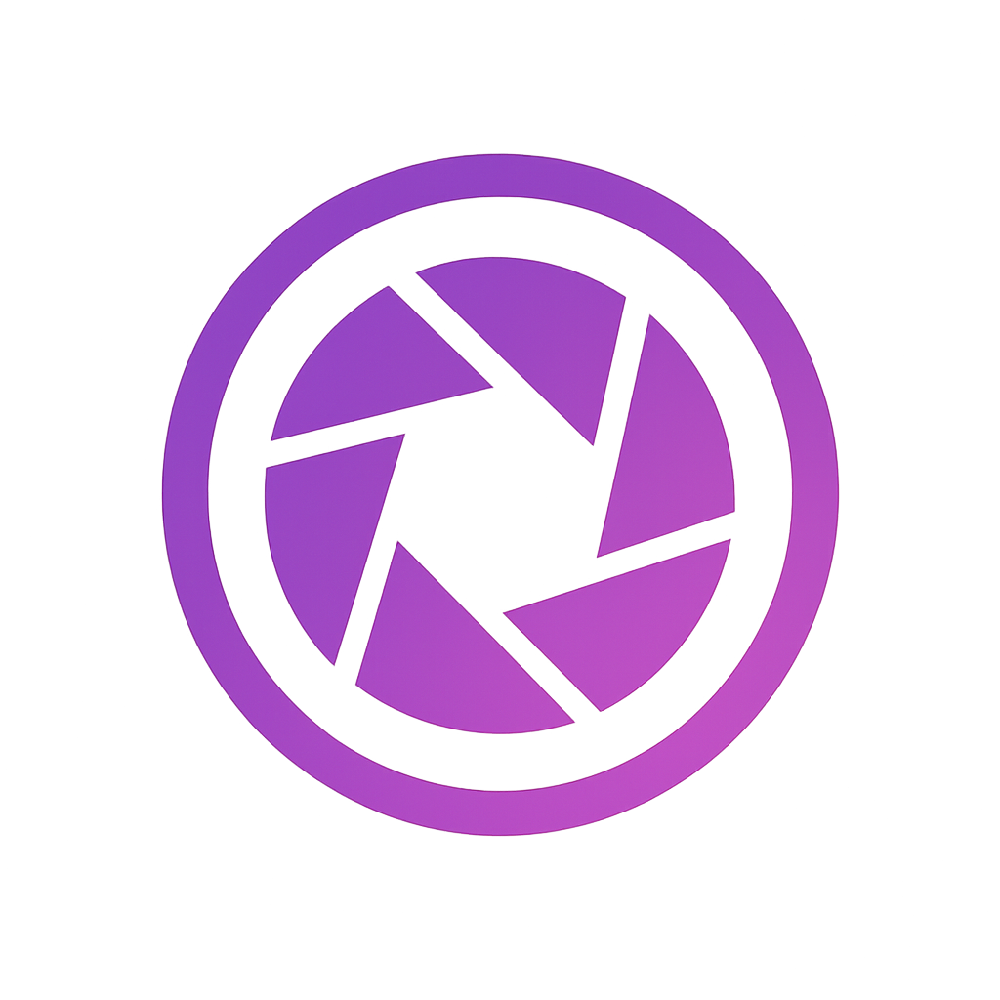

<p align="center">
  
</p>

# SnapMotion

SnapMotion is a modern Next.js + TypeScript web application that transforms static images into dynamic video frames using AI. Users can upload an image and watch as our AI creates multiple frames showing different poses and perspectives of their subject.

---

## ✨ Features

- 🚀 **Next.js 15** with App Router & React 19
- ⚡ **Modern UI/UX** with Tailwind CSS v4 and enhanced animations
- 🖼️ **Advanced Image Upload** with drag & drop, preview, and validation (PNG, JPEG, WEBP)
- 🤖 **AI Video Generation** via fal.ai API with secure backend processing
- 🎬 **Frame Extraction** from generated videos using ffmpeg
- 🔒 **Secure Architecture** - API keys never exposed to client
- 🎯 **Enhanced User Experience** with loading states, animations, and intuitive workflow
- 💾 **Download Functionality** - Individual frame downloads and bulk download options 

---

## 🎯 How It Works

1. **Upload Your Image** 📤
   - Drag & drop or click to select an image
   - Real-time preview with validation
   - Supports PNG, JPEG, and WEBP formats

2. **AI Processing** 🤖
   - Image sent securely to fal.ai for video generation
   - Custom AI prompt optimizes pose transformation
   - Beautiful loading animations show progress

3. **Frame Generation** 🎬
   - Video downloaded to secure temporary directory
   - ffmpeg extracts multiple high-quality frames
   - Frames uploaded to S3 with presigned URLs

4. **View & Download** 📱
   - Individual frame downloads with loading states
   - Bulk download option for all frames
   - Smooth animations and transitions


---

## 📋 Usage Guidelines

### **Perfect Subjects for Transformation:**
- 👤 **People** - Standing, sitting, dancing, or any human pose
- 🐾 **Animals** - Pets, wildlife, or any living creature  
- 🎭 **Characters** - Toys, statues, or digital characters

### **For Best Results:**
- ✅ Ensure the subject is clearly visible and not blurry
- ✅ Focus on one main object or figure
- ✅ Avoid cluttered or busy backgrounds
- ✅ Use good lighting and contrast

## 🚀 Getting Started

### 1. Install Dependencies

```bash
npm install
# or
yarn install
```

### 2. AWS Configuration

Ensure your AWS credentials are configured for S3 access:
- S3 bucket for frame storage
- Proper IAM permissions for upload/download


### 3. System Requirements

Install ffmpeg on your server:
```bash
# macOS
brew install ffmpeg

# Ubuntu/Debian
sudo apt-get install ffmpeg

# Windows
# Download from https://ffmpeg.org/download.html
```

### 4. Run Development Server

```bash
npm run dev
# or
yarn dev
```

Open [http://localhost:3000](http://localhost:3000) to see the application.

---

## 🏗️ Tech Stack

### **Frontend**
- [Next.js 15](https://nextjs.org/) - React framework with App Router
- [React 19](https://react.dev/) - Latest React with concurrent features
- [TypeScript](https://www.typescriptlang.org/) - Type safety and developer experience
- [Tailwind CSS v4](https://tailwindcss.com/) - Utility-first CSS framework

### **Backend & AI**
- [fal.ai](https://fal.ai/) - Generative AI API for video creation
- [ffmpeg](https://ffmpeg.org/) - Video processing and frame extraction
- [AWS S3](https://aws.amazon.com/s3/) - Cloud storage for generated frames

### **Infrastructure**
- AWS App Runner - Serverless deployment
- AWS ECR - Container registry for Docker images
- Terraform - Infrastructure as Code
- GitHub Actions - CI/CD automation

---

## 🔧 API Documentation

### **POST** `/api/generate-frames`

Handles the complete pipeline from image upload to frame generation.

**Request:**
- `Content-Type: multipart/form-data`
- `image: File` - Image file (PNG, JPEG, WEBP)

**Response:**
```json
{
  "frames": [
    {
      "url": "https://s3-presigned-url...",
    }
  ]
}
```

**Process Flow:**
1. Image validation and processing
2. AI video generation via fal.ai
3. Video download to temporary storage
4. Frame extraction using ffmpeg
5. Frame upload to S3 with presigned URLs
6. Cleanup of temporary files

---

## 🛡️ Security Features

- **API Key Protection** - Server-side only, never exposed to client
- **File Validation** - Strict image format and size checking  
- **Temporary Storage** - Automatic cleanup of processed files
- **Presigned URLs** - Secure, time-limited access to generated frames
- **Error Handling** - Graceful degradation and user-friendly messages

---

## 🚀 Deployment

The application is configured for deployment on AWS App Runner with containerized architecture:

1. **Infrastructure Setup** - Use provided Terraform configurations
2. **Container Registry** - Docker images stored in AWS ECR
3. **Environment Variables** - Configure in deployment environment
4. **Container Build** - Automated via GitHub Actions
5. **Health Checks** - Built-in health monitoring

### **Container Workflow**
- Application containerized using Docker
- Images pushed to AWS ECR repository
- App Runner pulls latest images for deployment
- Automatic scaling and load balancing


